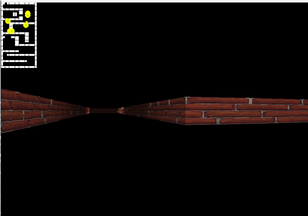
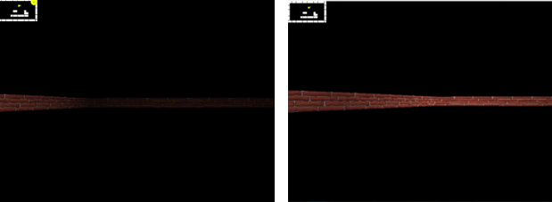
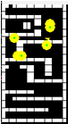

# Pygame Raycasting Stealth Prototype

A small 3D stealth game prototype developed in Python using Pygame as part of a university project.

## Features

- DDA Raycasting
- Textured walls
- Dynamic lighting system
- Minimap
- Multiple lamp types with independent timers
- Collision detection
- Victory and defeat conditions

## Technologies

- Python 3
- Pygame

## Screenshots

### Gameplay



### Dynamic lighting



### Minimap



## Controls

| Key | Action |
|------|--------|
| W A S D | Move |
| Mouse | Look around |
| ESC | Exit |

## Project Structure

```text
main.py            # Game loop
raycaster.py       # DDA Raycasting
render.py          # Rendering and textures
player.py          # Player movement
lamps.py           # Lamp logic
level.py           # Level generation
settings.py        # Constants
```

## Future Improvements

- Multiple levels
- Sound effects
- Enemy AI
- Better lighting
- Menus and settings

## Author

Aleksandar Ranchev
